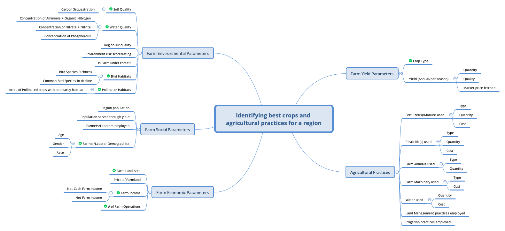

# Analysing Farming Practices in Midwest United States

This project aims to access various data sources on agriculture in Midwest US to analyze farming practices, demographics, and other environmental variables in the region. This is undertaken as a preliminary analysis to asssess the feasibility of Regenerative Farming practices in the region.

## Data Sources

A preliminary mind-map was prepared to assess all possible data that can be tapped for the analysis:

From these the below were selected for the analysis from corresponding data sources:

- [QuickStats data portal](https://quickstats.nass.usda.gov/) (USDA National Agricultural Statistical Service - NASS):
    - Farm Income Data
    - Farm Parameters (# of Farms Operated, Area Operated)
    - Producer Demographics (Age, Gender, Race)
- [USDA Economic Research Service](https://www.ers.usda.gov/data-products/farm-income-and-wealth-statistics/data-files-u-s-and-state-level-farm-income-and-wealth-statistics/) ERS estimates are based on a wide variety of sources – including both surveys (like NASS) and administrative data sources
    - Farm Income Data
- [Water Quality Portal](https://www.waterqualitydata.us/) (National Water Quality Monitoring Council)
    - Concentration of Ammonia + Organic Nitrogen
    - Concentration of Nitrate + Nitrite
    - Concentration of Phosphorous
- [Rapid Carbon Assessment (RaCA)](https://www.nrcs.usda.gov/resources/data-and-reports/rapid-carbon-assessment-raca#tables) – National Resources Conservation Service Soils (NRCSS)
    - Soil Organic Carbon at depth of 5-100cm
- [EnviroAtlas](https://www.epa.gov/enviroatlas/data-download-step-2?token=F-3cwXaAw64VtcTGyZQ6R9CBpbN1nCJpX0ECw0ccl4U) (US Environmental Protection Agency)
    - Acres of Pollinated Crops with no nearby habitat
    - Bird Species Richness
    - Common Bird species in decline

## Results from preliminary analysis

### Acres of Land used for Corn & Soybean from 1997-2021

### Net (Cash) Farm Income of Producers across States (2017)

### Net (Cash) Farm Income per Acre across farm sizes

We see that most of the differences in the Income/Acre across states is for the smaller farms that are less than 50 Acres in Area Operated. For larger farms, this value seems to converge across states

We see that for Missouri and Wisconsin, Income/Acre is less than zero for the smaller farms (potentially indicating losses), whereas for Iowa and Minnessota, it takes on very high values.

### Number of Farm Operations across counties

### Change in the number of Operations by Size (2012 vs 2017)

### Change in the area of Operations by Size (2012 vs 2017)

### RaCA Cumulative Soil Organic Carbon Stock

